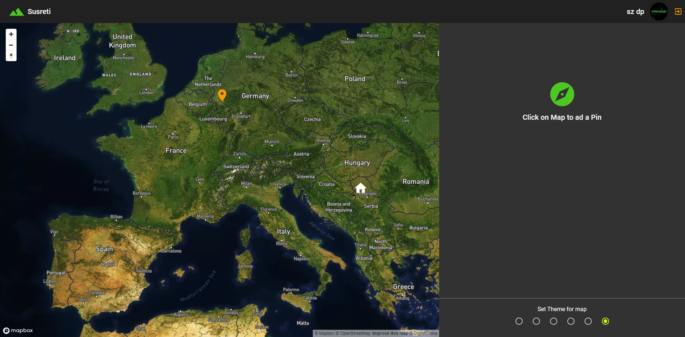
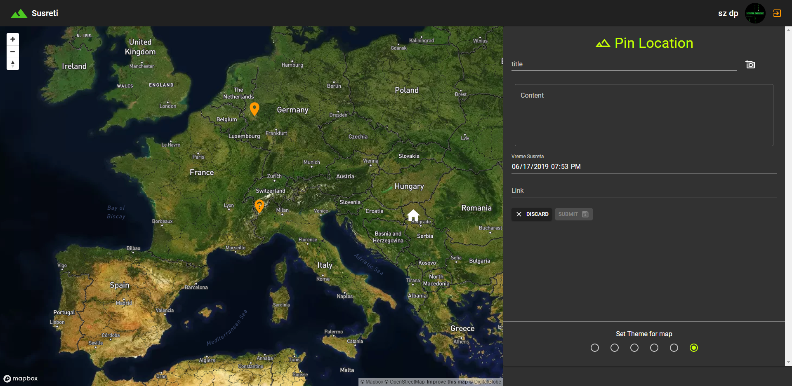
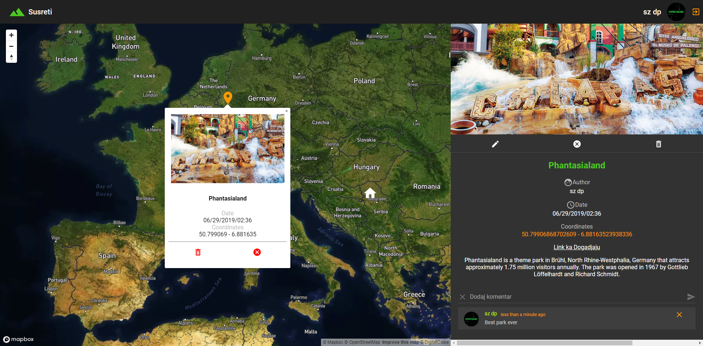

# GraphQl Apollo React Map

This is an Event map with Authentification, with options to add, edit or remove your own event, or if you are an admin, an option to remove all events. This is real-time map, state is in sync across different users through web socket. Also you can add comments to the event, discuss with others about it in real time. You can change map theme and it will be persisted in your browser.

> Backend is created with GraphQL Server - Apollo Server.

> Database is mongoDB

> Frontend is React with React Hooks.

## Install
Clone this project with `git clone https://github.com/drejcreative/Event-Map-App.git`

After it install all backend dependencies with `yarn`
Then run the same command in `client` folder to install all frontend dependencies 

## Development server
Run `yarn run dev` for a dev server. 

Run `yarn run start` in `client` folder to start react app. It will automatically open your default browser and show the app. It has a live reload integrated.